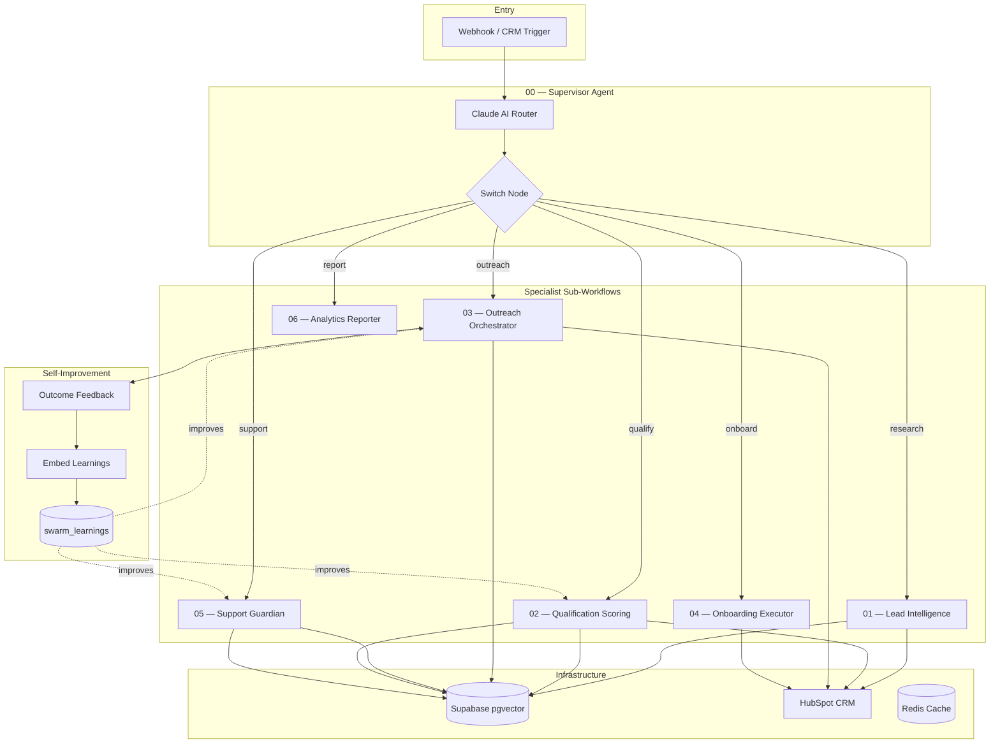

# autonomous-sales-swarm

> A fully autonomous multi-agent sales pipeline powered by n8n, Claude AI, and RAG — from lead intake to closed deal.

[](https://n8n.io)
[](https://anthropic.com)
[](https://supabase.com)
[](LICENSE)

---

## What It Does

This project is a **production-ready multi-agent swarm** that automates the entire B2B sales cycle:

| Agent | Role | Autonomy |
|-------|------|----------|
| **Supervisor** | Routes leads to the right agent based on context | Full |
| **Lead Intelligence** | Researches companies, scrapes websites, enriches CRM | Full |
| **Qualification** | Scores leads with weighted model + RAG context | Full |
| **Outreach** | Generates hyper-personalized multi-channel sequences | Human-in-loop |
| **Onboarding** | Automates post-sale setup (calendar, docs, welcome) | Full |
| **Support Guardian** | Answers 70%+ of support queries via RAG | Semi |
| **Analytics Reporter** | Daily/weekly AI-generated performance summaries | Full |

**Key stats:**
- 7 autonomous agents across 7 n8n workflows
- 5-criteria weighted lead scoring model
- RAG knowledge base with self-improvement loop
- Multi-channel outreach (Email, WhatsApp, Slack)
- Full CRM integration (HubSpot)

---

## Architecture



### Data Flow

1. **Lead enters** via webhook or CRM trigger
2. **Supervisor** classifies intent → routes to specialist
3. **Specialist agent** executes with RAG context + tools
4. **Results** written to CRM + vector DB
5. **Outcomes** fed back into RAG for self-improvement

---

## Quick Start

### Prerequisites

- Docker & Docker Compose
- Node.js 18+
- Python 3.11+
- API keys: Anthropic (Claude), OpenAI (embeddings), HubSpot

### 1. Clone & Configure

```bash
git clone https://github.com/your-username/autonomous-sales-swarm.git
cd autonomous-sales-swarm
cp .env.example infrastructure/.env
# Edit infrastructure/.env with your API keys
```

### 2. Deploy Everything

```bash
bash scripts/deploy.sh
```

This starts Docker services, initializes the database, seeds the RAG knowledge base, runs tests, and prints a status summary.

### 3. Manual Setup

```bash
# Start infrastructure
cd infrastructure && docker compose up -d

# Seed RAG knowledge base
bash scripts/seed-rag.sh

# Run tests
node tests/test-supervisor-routing.js
python tests/test-scoring-accuracy.py
```

### 4. Import Workflows

1. Open n8n at `http://localhost:5678`
2. Create credentials (Anthropic, HubSpot, Gmail, Supabase)
3. Import each `workflows/*.json` file
4. Update sub-workflow IDs in Execute Workflow nodes
5. Activate workflows (supervisor **last**)

See [docs/n8n-setup.md](docs/n8n-setup.md) for detailed instructions.

---

## Customization

This swarm is designed to be **domain-agnostic**. Customize it for your industry:

### Scoring Model

Edit `scoring/scoring-config.json` to adjust:
- **Weights**: Which criteria matter most for your leads
- **Thresholds**: When a lead is hot/warm/cold
- **Mappings**: How raw data maps to scores

### RAG Knowledge Base

Add your domain knowledge to `rag/knowledge-base/`:
- Product features and documentation
- Case studies and success stories
- Compliance/regulatory guides
- FAQ and support articles

Then run `bash scripts/seed-rag.sh` to embed.

### Agent Prompts

System prompts live in `config/prompts/`. Each agent has a dedicated prompt with:
- Role definition and boundaries
- Output format (structured XML)
- Tool-calling instructions
- Language/tone guidelines

### Outreach Templates

The outreach agent in `config/prompts/outreach-system.md` contains email and WhatsApp templates. Replace with your messaging and brand voice.

---

## Project Structure

```
autonomous-sales-swarm/
├── workflows/                    # n8n workflow JSON files
│   ├── 00-supervisor.json        # Master orchestrator
│   ├── 01-lead-intelligence.json # Company research
│   ├── 02-qualification-scoring.json
│   ├── 03-outreach-orchestrator.json
│   ├── 04-onboarding-executor.json
│   ├── 05-support-guardian.json
│   └── 06-analytics-reporter.json
├── config/
│   └── prompts/                  # Agent system prompts
├── agents/                       # Claude Code agent definitions
├── skills/                       # Claude Code skill definitions
├── scoring/
│   ├── lead_scoring_model.py     # Weighted scoring logic
│   └── scoring-config.json       # Weights & thresholds
├── rag/
│   ├── knowledge-base/           # Source docs for embedding
│   ├── embed-docs.py             # Embedding script
│   └── retrieval-config.json     # RAG configuration
├── infrastructure/
│   ├── docker-compose.yml        # n8n + Postgres + Redis
│   ├── .env.example              # Environment template
│   └── init-supabase.sql         # Database schema
├── tests/
│   ├── test-leads.json           # 10 simulated test leads
│   ├── test-supervisor-routing.js
│   └── test-scoring-accuracy.py
├── scripts/
│   ├── deploy.sh                 # One-command deployment
│   ├── seed-rag.sh               # Seed knowledge base
│   └── generate-test-data.py     # Generate test leads
├── docs/                         # Documentation
├── CLAUDE.md                     # Claude Code project config
└── .claude/                      # Claude Code agents & skills
```

---

## Tech Stack

| Component | Technology | Purpose |
|-----------|-----------|---------|
| Orchestration | n8n 1.70+ | Workflow engine with AI Agent Nodes |
| Primary LLM | Claude Sonnet 4 | Agent reasoning + German output |
| Fallback LLM | GPT-4o | Secondary model |
| Vector DB | Supabase (pgvector) | RAG storage + lead memory |
| CRM | HubSpot | Lead management |
| Email | Gmail / SendGrid | Outreach delivery |
| Messaging | WhatsApp Business API | Direct messaging |
| Notifications | Slack | Team alerts |
| Cache | Redis | Rate limiting + state |
| Deployment | Docker Compose | Infrastructure |

---

## Claude Code Integration

This project is fully configured for [Claude Code](https://docs.anthropic.com/en/docs/claude-code):

- **CLAUDE.md** — Project context and conventions
- **agents/** — Specialized sub-agents (workflow builder, prompt engineer, RAG architect, test simulator)
- **skills/** — Domain knowledge (B2B context, n8n patterns, Supabase pgvector)
- **commands/** — Custom slash commands (`/build-agent`, `/test-lead`)

```bash
# Use Claude Code to extend the swarm
claude
> /build-agent — scaffold a new specialist agent
> /test-lead  — simulate a lead through the pipeline
```

---

## Documentation

- [Architecture Overview](docs/architecture.md) — System design and data flow
- [Agent Reference](docs/agents.md) — Each agent's role, tools, and prompts
- [n8n Setup Guide](docs/n8n-setup.md) — Workflow import and configuration
- [RAG Setup Guide](docs/rag-setup.md) — Knowledge base and embedding setup

---

## Contributing

See [CONTRIBUTING.md](CONTRIBUTING.md) for guidelines.

---

## License

MIT — see [LICENSE](LICENSE) for details.

---

**Built with Claude Code** — an autonomous multi-agent system that demonstrates production-grade AI orchestration patterns.
